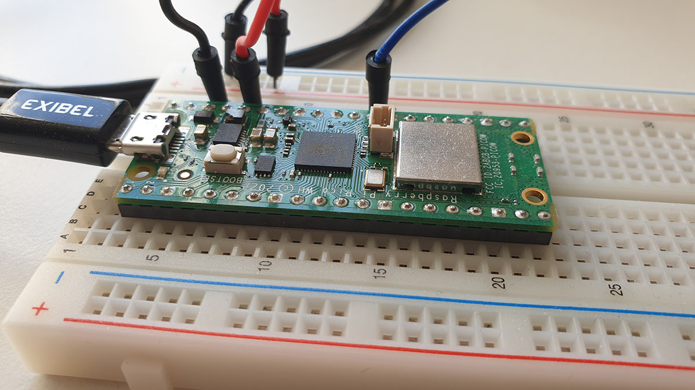
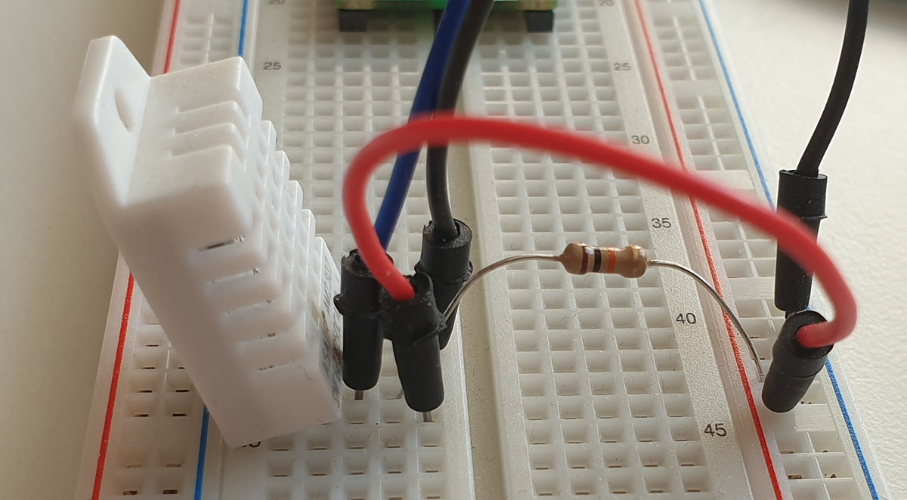
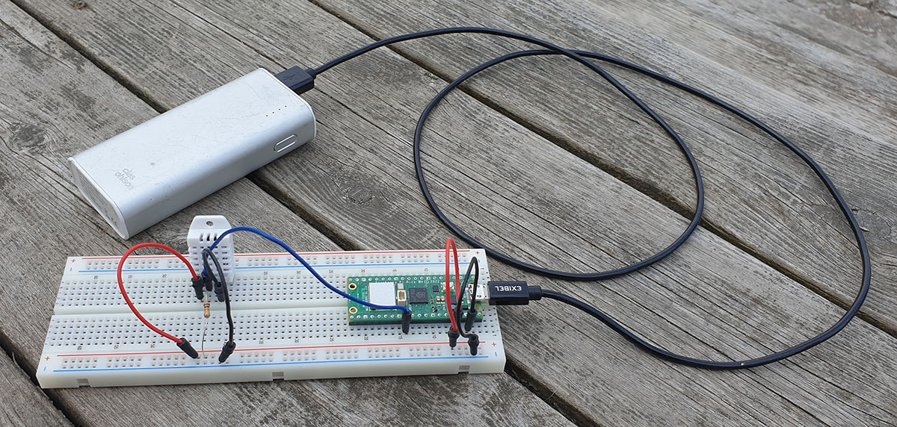
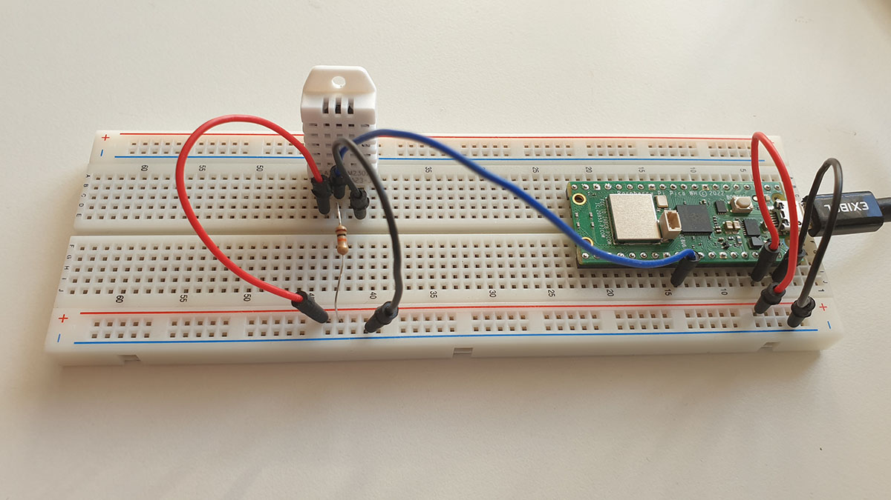
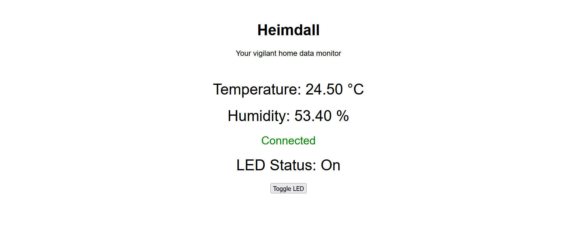
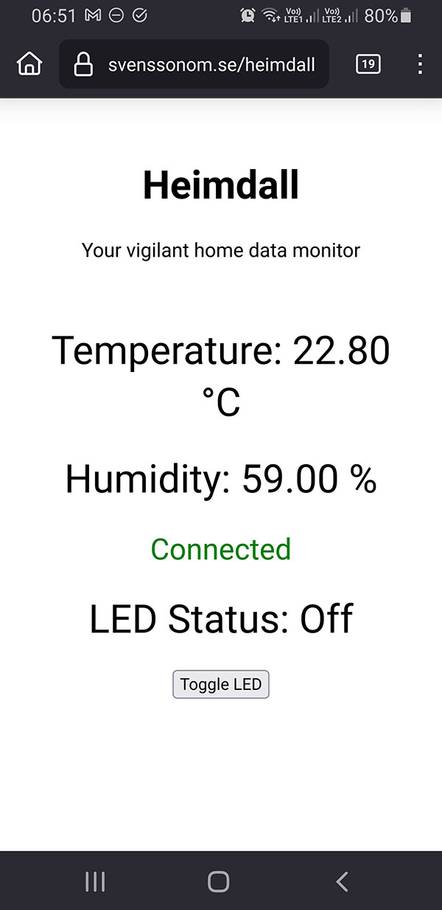
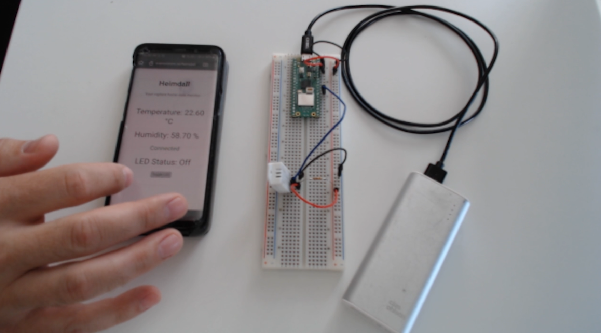

# Tutorial - Temperatur- och luftfuktighetsmätare

Den här kombinerade guide och projektredovisningen visar hur en temperatur- och luftfuktighetsmätare, som skickar mätvärden via wifi till en server, från vilken värden hämtas och presenteras i ett webbgränssnitt, kan byggas. Samt hur en inbyggd LED kan fjärrstyras.

## Inledning

Projektet använder förhållandevis billiga elektroniska komponenter, kod i form av både python och javascript samt kräver tillgång till en server. Det har utförts av Fredrik Svensson, fs222id, under våren 2024 inom kursen 1DV027 - Webben som applikationsplattform, vid Linnéuniversitetet. Om du följer guiden kan du få en fungerande applikation på bara några timmar.  

### Mål

Projektets mål är att uppfylla de obligatoriska krav som ställts av kursen med hjälp av de komponenter som föreslagits. Förhoppningsvis kommer jag att lära mig något kring informationsflödet till och från elektronik som kopplas till nätet, IoT. Den data som produceras kommer inte att användas till något annat än att ge en ögonblicksbild av temperatur- och luftfuktighetssituationen på platser inom räckhåll för det trådlösa nätverk som finns i min bostad.

### Material

Till projektet har jag använt följande komponenter:


**Raspberry Pi Pico WH:** Mikrokontroller som kör MicroPython. Den tvåkärniga processorn har en hastighet på upp till 133 MHz, minnet ligger på 264 kB och lagrinsutrymmet är 2MB. H:et betyder att den har förberedda pins som passar till ett kopplingsdäck, headers. W står för wireless, och innebär att det finns en enhet som stödjer 2,4 GHz trådlös överföring samt Bluetoothe 5.2. Pris: 109 kronor. 
[Läs mer på raspberrypi.com](https://www.raspberrypi.com/documentation/microcontrollers/raspberry-pi-pico.html)

**DHT22 Sensor:** Sensor som kan mäta temperatur och luftfuktighet. Levererar data varannan sekund, och ska klara intervallen -40 till +80 grader Celsius och 0-100 procent luftfuktighet, med felmarginal på en halv grad respektive 2-5 procent. Pris: 129 kronor.
[Läs mer adafruit.com](https://www.adafruit.com/product/385)


**Motstånd:** För att ovanstående komponenter ska samarbete krävs ett motstånd, i det här fallet 10kOhm. Pris: 1 krona.

**Kopplingsdäck:** Ett smidigt sätt att montera komponenter i en utvecklingsmiljö. Pris: 69 kronor.

**Kablar:** Krävs för att koppla samman komponenterna. Pris: 39 kronor (för 65 stycken av blandade längder).

**Batteri:** Som strömförsörjning har jag använt ett gammal batteri, Powerbank, från clas ohlson, samt en sladd märkt exibel. Båda låg i en byrålåda. Pris: Okänt.



Samtliga komponenter, förutom batteriet med tillhörande kabel, är inköpta hos [electro:kit](https://www.electrokit.com/), priserna är inklusive moms.

### Utvecklingsmiljö

Som utvecklingsmiljö har jag använt Visual Studio Code, med tillägget [MicroPico](https://github.com/paulober/MicroPico). Utvecklingsspråk för Picon är micropython, och till server och webbapplikation har jag använt javascript. Att använda Visual Studio Code med MicroPico är relativt rättframt, efter installation kan du koppla in picon via usb och i mitt fall har den då varje gång automatiskt fått kontakt med utvecklingsmiljön. För att flytta filer till, och från, picon aktiveras "virtual Pico workspace" med en knapptryckning, och det går sedan att köra filerna direkt. Om en utgår från filen main.py kommer denna att köras automatiskt varje gång picon kopplas till en strömkälla.

### Kopplingsschema



På bilden ovan visas de kopplingar som jag har gjort för att få sensorn att skicka data till picon. Den blå kabeln kopplar sensorns datapin till picon, (i mitt fall GP22, pin 29, men det finns flera möjliga varianter). Från samma pin på sensorn är även resistorn kopplad, men den går till strömförsörjningen, samma som de röda kablarna. De är dessa som förser sensorn med en spänning på 3.3V, från pin 36. De svarata kablarna är jord, och kopplar ihop pin 38 på picon med sensorns fjärde pin. 

Anledningen till att det krävs en resistor är för att stabilisera spänningen, i det här fallet lägga den på en jämn och hög nivå även när ingen data skickas för att förhindra felaktiga signaler.

### Plattform

Jag har valt att installera en MQTT-broker, mosquitto, på en VPS, för att hantera dataflödet från picon till, och från, en webbapplikation, som ligger på samma server. Valet var enkelt då servern hanterar flera av mina privata projekt samt tidigare projekt i samma kurs. 

### Koden

Projektets kod finns dels på utbildningens GitLab-konto och på mitt privata GitHub, under projektnamnet .

När det gäller koden på picon kan det vara värt att nämna delen som hanterar meddelanden. Det är en asynkron funktion som läser in det mottagna MQTT-meddelandet. Om meddelandet har nyckeln "action" med värdet "toggle_led" kommer status för LED att ändras. Är den släckt så tänds den, och vice versa. Den nya statusen returneras till MQTT-brokern.

```python
async def handle_message(topic, msg):
    try:
        data = json.loads(msg)
        if data.get('action') == 'toggle_led':
            ledPin.value(not ledPin.value())
            # Skicka LED-status till MQTT broker
            led_status = 'on' if ledPin.value() else 'off'
            client.publish(MQTT_LED_STATUS_TOPIC, json.dumps({'led_status': led_status}))
    except Exception as e:
        print('Failed to handle message:', e)
```

För att webbapplikation ska kunna hantera data måste meddelanden till och från MQTT-brokern gå via websocket, då webbläsare inte kan hantera MQTT. Servern prenumerar på meddelanden från brokern, och omvandlar dessa. Den gör även det omvända, alltså hanterar inkommande websocket anslutningar och omvandlar dessa till MQTT-meddelanden.

```javascript
mqttClient.on('message', (topic, message) => {
  console.log('Received message:', topic, message.toString());
  wss.clients.forEach(client => {
    if (client.readyState === WebSocket.OPEN) {
      client.send(message.toString());
    }
  });
});
```

```javascript
ws.on('message', (message) => {
    console.log('Received message from WebSocket client:', message);
    // Forward the message to the MQTT broker
    mqttClient.publish('test/iot', message);
  });
```

När det gäller webbapplikation är det en väldigt enkel html-fil med en script-tagg. Nedan visas ett utdrag ur koden som hanterar mottagande av websocket-meddelande och visar det på sidan.

```javascript
ws.onmessage = (event) => {
    console.log('Message from server:', event.data);
    const data = JSON.parse(event.data);
    if (data.temperature !== undefined && data.humidity !== undefined) {
        document.getElementById('temperature').innerText = data.temperature.toFixed(2);
        document.getElementById('humidity').innerText = data.humidity.toFixed(2);
    }
    if (data.led_status !== undefined) {
        document.getElementById('ledStatus').innerText = data.led_status === 'on' ? 'On' : 'Off';
    }
};
```

### Dataflöde

Sensorn som är koppla till picon mäter temperatur och luftfuktighet varannan sekund. Jag har därför lagt in en väntetid på två sekunder i den asynkrona funktion som läser av dessa. Även den lopp som kollar efter inkommande meddelanden har en väntetid, en sekund, för att inte ständigt belasta processorn och släppa in andra funktioner.

Efter att värden avlästs skickas ett meddelande till MQTT-brokern via Wifi. Detta har på picon omvandlats till json. MQTT-brokern skickar datan till prenumeranterna, i mitt fall den server som skickar vidare via websocket. Detta meddelande tas i sin tur emot av webbapplikationen, som visar värdena. 

I webbapplikationen går det att klicka på en knapp för att tända eller släcka LED:en på picon. Vid knapptryckning skickas ett paket i json-format till websocket och servern som omvandlar det till ett MQTT-meddelande. Picon prenumerar på dessa meddelanden, tar emot och byter status på LED:en. Statusbytet skickas, med det faktiska tillståndet på eller av, tillbaka till MQTT-brokern, snappas upp av servern som skickar vidare via websocket till webbapplikationen som nu kan visa om LED:en lyser eller är släckt.

### Datavisualisering



Visualisering av data i webbapplikation är enkel, siffror för både temperatur och luftfuktighet. Ingen data sparas.



Utöver data visas även status för LED på Picon. Direkt när sidan öppnas är den dock okänd, det krävs att användaren klickar på knappen (Toggle LED) för att skicka signal, ändra läget och får då upp aktuell status.

### Sammanfattning

[](video/Demo_1.mp4)

I filmklippet ovan visas hur webbapplikationen visar temperatur och luftfuktighet. Komponenterna är monterade på kopplingsdäcket och får sin strömförsöjrning från batteriet. Även funktionen med att slå på och av LED visas, samt hur utandningsluften ökar luftfuktigheten.

Kul projekt som tog rimligt lång tid. Hade jag haft ytterligare några timmar att lägga hade jag snyggat till gränssnittet för att sedan implementera en enklare databas för att kunna visa förändringar i tid.
